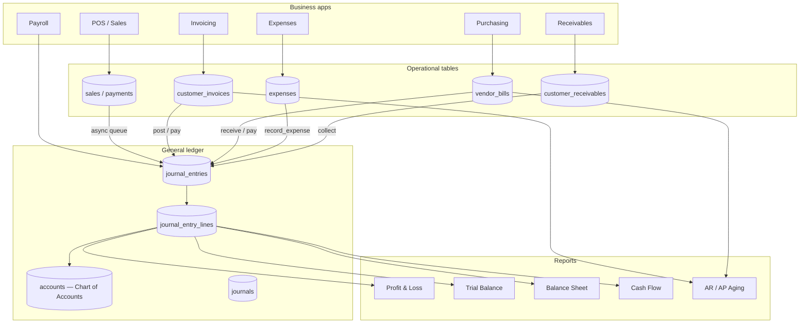
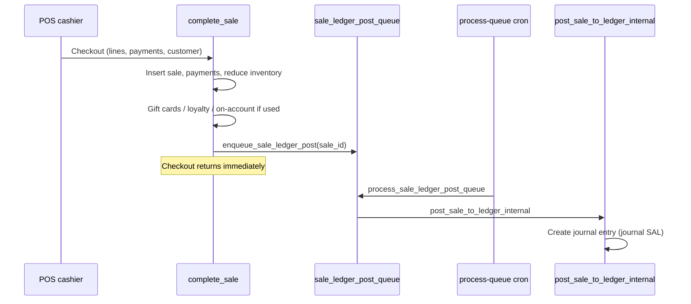
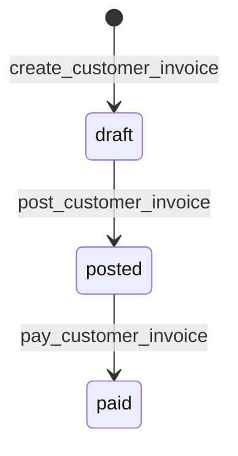
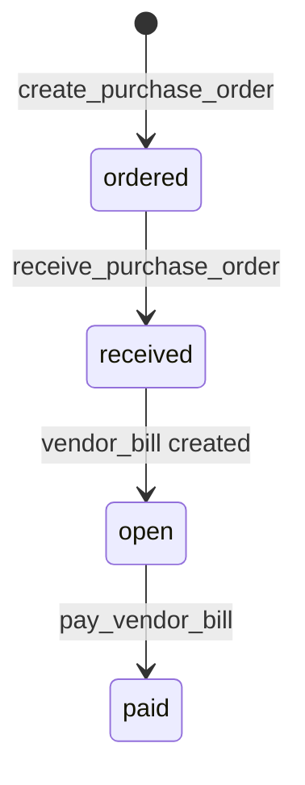

# NexusERP — Full Accounting Process Guide

This document explains how accounting works in NexusERP: the general ledger, how money flows from POS and other modules into books, every major report, and how the pieces connect.

**Audience:** accountants, finance leads, and developers integrating with the system.

---

## 1. Architecture at a glance

NexusERP uses **double-entry bookkeeping**. Every financial event that hits the books creates a balanced **journal entry** (debits = credits).

### Two reporting modes

| Mode | Used by | Data source |
|------|---------|-------------|
| **Operational** | Default P&L on `/reports`, optional on `/financials` | Completed `sales`, `expenses` rollups |
| **GL (General Ledger)** | Trial balance, balance sheet, cash flow, GL-mode P&L | Posted `journal_entry_lines` only |

Accountants should use **GL mode** for official books after sales are posted to the ledger.

---

## 2. Chart of accounts (default)

Seeded per organization by `ensure_default_accounts(org_id)`:

| Code | Name | Type | Typical use |
|------|------|------|-------------|
| 1000 | Cash on Hand | Asset | Cash POS payments |
| 1010 | Bank | Asset | Bank transfer payments |
| 1020 | Mobile Money | Asset | M-Pesa, Telebirr, etc. |
| 1100 | Accounts Receivable | Asset | Invoices, on-account sales |
| 1200 | Inventory | Asset | Stock on hand |
| 1500 | Fixed Assets | Asset | Equipment (Phase F) |
| 1590 | Accumulated Depreciation | Asset (contra) | Depreciation |
| 2000 | Accounts Payable | Liability | Vendor bills |
| 2100 | Tax Payable | Liability | VAT/sales tax collected |
| 2300 | Store Credit | Liability | Customer store credit |
| 2310 | Gift Cards | Liability | Unredeemed gift cards |
| 3000 | Owner Equity | Equity | Opening equity |
| 3900 | Retained Earnings | Equity | P&L roll-forward |
| 4000 | Sales Revenue | Income | Product/service revenue |
| 5000 | Cost of Goods Sold | Expense | Inventory cost of sales |
| 6000 | Operating Expenses | Expense | General OpEx |
| 6100–6300 | Rent, Utilities, Maintenance | Expense | Categorized OpEx |
| 6400 | Salaries | Expense | Payroll |
| 6510 | Depreciation Expense | Expense | Fixed-asset depreciation |

### Journals (books)

| Code | Name | Used for |
|------|------|----------|
| SAL | Sales | POS sales, voids, returns |
| PUR | Purchases | PO receipts, vendor bills |
| INV | Invoicing | Customer invoices & credit notes |
| CSH | Cash | Cash movements |
| BNK | Bank | Bank movements |
| GEN | General | Manual JEs, expenses, recurring entries |

### Payment method → GL account mapping

Function: `_payment_method_account_code(method)`

| Payment method | Account |
|----------------|---------|
| cash | 1000 |
| bank_transfer | 1010 |
| mobile_money | 1020 |
| on_account | 1100 (AR) |
| store_credit | 2300 |
| gift_card | 2310 |
| loyalty | 2300 (store credit liability) |

---

## 3. End-to-end processes

### 3.1 POS sale → General ledger

**Journal entry for a typical sale:**

| Line | Debit | Credit | Account |
|------|-------|--------|---------|
| Payment received | ✓ | | 1000 / 1010 / 1020 / 1100 / 2300 / 2310 |
| Revenue | | ✓ | 4000 Sales Revenue |
| Tax collected | | ✓ | 2100 Tax Payable |
| COGS | ✓ | | 5000 COGS |
| Inventory relief | | ✓ | 1200 Inventory |

**Rules:**
- GL posting is **async** (queue) so checkout stays fast.
- Skipped if any payment is still `pending` (e.g. mobile money awaiting confirmation).
- Skipped if org setting `pos_auto_post_sales` is false (banner on `/financials` lets managers batch-post).
- **Idempotent:** one JE per sale (`source_type = 'sale'`, `source_id = sale_id`).

**Key functions:**

| Function | Role |
|----------|------|
| `complete_sale(...)` | POS checkout (operational) |
| `enqueue_sale_ledger_post(sale_id)` | Add sale to GL queue |
| `process_sale_ledger_post_queue(limit)` | Worker drains queue |
| `post_sale_to_ledger_internal(sale_id)` | Build & post sale JE |
| `maybe_auto_post_sale(sale_id)` | Re-enqueue after mobile money confirms |
| `count_unposted_sales(org_id)` | How many sales lack GL |
| `post_unposted_sales_batch(org_id)` | Manual / banner batch post |

**Worker:** Vercel cron hits `/api/webhooks/process-queue` (also processes refunds, notifications, security alerts).

---

### 3.2 Sale void & partial return

| Event | Queue | GL function | source_type |
|-------|-------|-------------|-------------|
| Full void | `refund_void_ledger_queue` | `post_refund_void_to_ledger` | `sale_void` |
| Partial return | `return_ledger_post_queue` | `post_partial_return_to_ledger` | `sale_return` |

Void reverses the original sale JE (swaps debits/credits). Store-credit refunds map cash credits to account 2300.

---

### 3.3 Customer invoicing (formal AR)

| Step | Function | GL effect |
|------|----------|-----------|
| Create draft | `create_customer_invoice` | None |
| Post | `post_customer_invoice` | Dr 1100 AR, Cr 4000 Revenue, Cr 2100 Tax |
| Pay | `pay_customer_invoice` | Dr Cash/Bank/Mobile, Cr 1100 AR |

**UI:** `/invoicing` — invoice register, credit notes.

**Credit notes:** `create_customer_credit_note` → `post_customer_credit_note` (reverses revenue/tax; settles to AR, store credit, or cash).

---

### 3.4 POS on-account (informal AR)

Separate from formal invoices:

1. Customer buys on account at POS → `complete_sale` with `on_account` payment.
2. `customer_receivables.balance` increases; sale GL debits **1100 AR**.
3. Later collection → `collect_customer_receivable` → Dr cash/bank, Cr AR.

**UI:** `/receivables` — balances, transaction history, collect payment.

**Functions:** `collect_customer_receivable`, `update_customer_account_terms`.

---

### 3.5 Purchasing & accounts payable

| Step | Function | GL effect |
|------|----------|-----------|
| Create PO | `create_purchase_order` | None |
| Receive | `receive_purchase_order` | Dr 1200 Inventory, Cr 2000 AP; updates avg cost |
| Pay bill | `pay_vendor_bill` | Dr 2000 AP, Cr Cash/Bank/Mobile |

**UI:** `/purchasing`.

**Connection to COGS:** Inventory cost from PO receipts flows into variant cost → sale posting relieves inventory at that cost.

---

### 3.6 Expenses

| Function | GL effect |
|----------|-----------|
| `record_expense(...)` | Dr expense account (category or 6000), Cr cash/bank/mobile |

**UI:** `/expenses` (operational), expense categories map to GL accounts.

**Journal:** GEN, `source_type = 'expense'`.

---

### 3.7 Payroll

| Function | GL effect |
|----------|-----------|
| `run_payroll(...)` | Dr 6400 Salaries, Cr tax/deduction accounts, Cr net pay (cash/bank) |

**UI:** `/hr` (payroll runs).

---

### 3.8 Manual journal entries

Accountants can post adjusting entries:

| Function | Purpose |
|----------|---------|
| `post_journal_entry(...)` | Create JE (may start as draft) |
| `approve_journal_entry(id)` | Approve draft → posted |
| `reject_journal_entry_draft(id)` | Reject draft |
| `list_journal_entry_drafts(org_id)` | Pending drafts |

**Internal writer (no auth, used by automation):** `_post_journal_entry_balanced(...)`.

**UI:** `/financials` → Manual JE tab. Supports analytic dimensions (store, project, department).

---

### 3.9 Fiscal periods & controls

| Function | Purpose |
|----------|---------|
| `ensure_fiscal_year(org_id, year)` | Create fiscal calendar |
| `list_fiscal_periods(org_id)` | List periods |
| `close_fiscal_period(period_id)` | Lock period |
| `reopen_fiscal_period(period_id)` | Reopen (managers) |
| `_assert_accounting_date_open(org_id, date)` | Blocks posting into closed periods |

**UI:** `/financials` → Periods tab.

---

### 3.10 Bank reconciliation

| Function | Purpose |
|----------|---------|
| `list_bank_accounts(org_id)` | Bank accounts linked to GL 1010 |
| `import_bank_statement(...)` | Import CSV statement lines |
| `auto_match_bank_statement(statement_id)` | Auto-match to JEs |
| `match_bank_statement_line(...)` | Manual match |
| `get_bank_reconciliation(account_id)` | Reconciliation view |

**UI:** `/financials` → Banking tab.

---

### 3.11 Fixed assets & depreciation

| Function | Purpose |
|----------|---------|
| `register_fixed_asset(...)` | Add asset to register |
| `run_depreciation_batch(org_id)` | Post depreciation JEs |
| `dispose_fixed_asset(asset_id)` | Dispose & post gain/loss |

**UI:** `/financials` → Assets tab.

---

### 3.12 Recurring journals & automation

| Function | Purpose |
|----------|---------|
| `upsert_recurring_journal_template(...)` | Rent, accruals, etc. |
| `run_recurring_journals(org_id)` | Execute due templates |
| `list_invoices_needing_reminder(org_id)` | Overdue invoices |
| `enqueue_invoice_reminder_notification(invoice_id)` | Email reminder queue |

**UI:** `/financials` → Automation tab.

---

## 4. All financial reports

### 4.1 Where to find them

| App route | App name | Focus |
|-----------|----------|-------|
| `/financials` | Accounting | Official statements, ledger, COA, controls |
| `/reports` | Reports | Operational registers (sales, expenses, shifts) |
| `/invoicing` | Invoicing | Invoice & credit note workflow |
| `/receivables` | Receivables | On-account AR |

### 4.2 Statement reports (`/financials`)

| Report | RPC | What it shows |
|--------|-----|---------------|
| Profit & Loss | `profit_and_loss(org, from, to, mode)` | Revenue, COGS, gross profit, OpEx, net income |
| Comparative P&L | `comparative_profit_and_loss(...)` | Period-over-period |
| Balance Sheet | `balance_sheet(org, as_of)` | Assets, liabilities, equity |
| Comparative BS | `comparative_balance_sheet(...)` | Period-over-period |
| Cash Flow | `cash_flow(org, from, to)` | Operating/investing/financing cash |
| Trial Balance | `trial_balance(org, as_of)` | Every account debit/credit/balance |
| AR Aging | `accounts_receivable_aging(org, as_of)` | Invoices + on-account by bucket |
| AP Aging | `accounts_payable_aging(org, as_of)` | Open vendor bills by bucket |
| Tax Summary | `tax_summary_report(org, from, to)` | Tax collected vs paid |
| Budget vs Actual | `budget_vs_actual(org, budget_id, from, to)` | Budget variance |
| Analytic summary | `analytic_ledger_summary(org, dim, from, to)` | By store / project / department |
| Consolidated P&L | `consolidated_profit_and_loss(group_id, ...)` | Multi-org rollup |
| Consolidated BS | `consolidated_balance_sheet(group_id, ...)` | Multi-org rollup |
| Chart data | `financials_chart_data(org, from, to)` | Dashboard charts |
| Report snapshots | `save/get/list_financial_report_snapshot` | Saved P&L/BS for audit |

**P&L modes:**
- `operational` — reads `sales` + `expenses` (fast, matches ops)
- `gl` — reads posted journal lines only (official books)

### 4.3 Operational reports (`/reports`)

| Tab | Data source |
|-----|-------------|
| Executive summary | `profit_and_loss`, `dashboard_stats` |
| Sales register | Table `sales` |
| Transactions | `sales` + lines + payments |
| Expense register | Table `expenses` |
| Register shifts | Table `register_sessions` |
| Audit trail | `list_org_audit_logs` |

### 4.4 Export

All exports are **CSV** (client-side download). No PDF in accounting modules yet.

---

## 5. Complete RPC function catalog

### GL core

| Function | Description |
|----------|-------------|
| `ensure_default_accounts(org_id)` | Seed COA + journals |
| `account_id_by_code(org_id, code)` | Resolve account UUID |
| `list_accounts(org_id)` | List COA |
| `upsert_account(...)` | Create/update account |
| `post_journal_entry(...)` | Manual balanced JE |
| `_post_journal_entry_balanced(...)` | Internal JE writer |
| `approve_journal_entry` / `reject_journal_entry_draft` | Draft workflow |
| `list_journal_entries_page(...)` | Paginated ledger browser |
| `list_journal_entry_drafts(org_id)` | Pending drafts |

### POS → GL

| Function | Description |
|----------|-------------|
| `complete_sale(...)` | POS checkout |
| `enqueue_sale_ledger_post(sale_id)` | Queue GL post |
| `process_sale_ledger_post_queue(limit)` | Worker |
| `post_sale_to_ledger(sale_id)` | Auth-checked post |
| `post_sale_to_ledger_internal(sale_id)` | Core sale JE builder |
| `maybe_auto_post_sale(sale_id)` | After mobile money confirm |
| `count_unposted_sales` / `post_unposted_sales_batch` | Backfill |
| `post_refund_void_to_ledger` | Void reversal JE |
| `post_partial_return_to_ledger` | Partial return JE |
| `enqueue_refund_void_ledger_post` / `enqueue_return_ledger_post` | Queue enqueue |
| `process_refund_ledger_post_queue` | Refund worker |

### Invoicing & AR

| Function | Description |
|----------|-------------|
| `next_invoice_no(org_id)` | Next invoice number |
| `create_customer_invoice(...)` | Draft invoice |
| `post_customer_invoice(invoice_id)` | Post to GL |
| `pay_customer_invoice(invoice_id, ...)` | Record payment |
| `create_customer_credit_note(...)` | Draft credit note |
| `post_customer_credit_note(id)` | Post credit note |
| `collect_customer_receivable(...)` | On-account collection |
| `accounts_receivable_aging(org, as_of)` | AR aging report |

### AP & purchasing

| Function | Description |
|----------|-------------|
| `create_purchase_order(...)` | Create PO |
| `receive_purchase_order(po_id)` | Receive stock + bill + GL |
| `pay_vendor_bill(bill_id, ...)` | Pay AP |
| `accounts_payable_aging(org, as_of)` | AP aging report |

### Expenses & payroll

| Function | Description |
|----------|-------------|
| `record_expense(...)` | Expense + JE |
| `run_payroll(...)` | Payroll run + JE |

### Reports

| Function | Description |
|----------|-------------|
| `profit_and_loss` | P&L statement |
| `comparative_profit_and_loss` | Multi-period P&L |
| `balance_sheet` | Balance sheet |
| `comparative_balance_sheet` | Multi-period BS |
| `cash_flow` | Cash flow statement |
| `trial_balance` | Trial balance |
| `tax_summary_report` | Tax report |
| `analytic_ledger_summary` | Dimension analytics |
| `budget_vs_actual` | Budget variance |
| `consolidated_profit_and_loss` / `consolidated_balance_sheet` | Group consolidation |
| `financials_chart_data` | Chart series |

### Control & enterprise

| Function | Description |
|----------|-------------|
| `ensure_fiscal_year` / `list_fiscal_periods` | Fiscal calendar |
| `close_fiscal_period` / `reopen_fiscal_period` | Period lock |
| `list_bank_accounts` / `import_bank_statement` | Banking |
| `match_bank_statement_line` / `auto_match_bank_statement` | Bank rec |
| `list_tax_codes` / `upsert_tax_code` | Tax codes |
| `list_budgets` / `upsert_budget` | Budgets |
| `list_departments` / `upsert_department` | Analytic departments |
| `register_fixed_asset` / `run_depreciation_batch` | Fixed assets |
| `list_consolidation_groups` / `upsert_consolidation_group` | Consolidation |
| `upsert_recurring_journal_template` / `run_recurring_journals` | Recurring JEs |

---

## 6. How modules connect (summary table)

| Source module | Trigger | Operational table | GL source_type | Debit | Credit |
|---------------|---------|-------------------|----------------|-------|--------|
| POS sale | `complete_sale` → queue | `sales`, `payments` | `sale` | Cash/AR/etc + COGS | Revenue + Tax + Inventory |
| POS void | `void_sale_*` → queue | `sales` status | `sale_void` | Reverses sale JE | Reverses sale JE |
| POS return | `partial_return_sale` → queue | `sale_returns` | `sale_return` | Partial reversal | Partial reversal |
| Invoice | `post_customer_invoice` | `customer_invoices` | `invoice` | AR | Revenue + Tax |
| Invoice payment | `pay_customer_invoice` | `customer_invoices` | `invoice_payment` | Cash/Bank | AR |
| On-account collect | `collect_customer_receivable` | `customer_receivables` | `receivable_collection` | Cash/Bank | AR |
| Credit note | `post_customer_credit_note` | `customer_credit_notes` | `credit_note` | Revenue/Tax reversal | AR or cash/credit |
| PO receive | `receive_purchase_order` | `vendor_bills` | `purchase` | Inventory | AP |
| Bill pay | `pay_vendor_bill` | `vendor_bills` | `bill_payment` | AP | Cash/Bank |
| Expense | `record_expense` | `expenses` | `expense` | OpEx | Cash/Bank |
| Payroll | `run_payroll` | `payroll_runs` | `payroll` | Salaries | Tax + Net pay |
| Manual JE | `post_journal_entry` | — | `manual` | Per lines | Per lines |
| Depreciation | `run_depreciation_batch` | `fixed_asset_depreciation` | `depreciation` | Depreciation exp | Accum depr |
| Recurring JE | `run_recurring_journals` | — | `recurring` | Per template | Per template |

---

## 7. Database tables (accounting spine)

| Table | Purpose |
|-------|---------|
| `accounts` | Chart of accounts |
| `journals` | Journal definitions |
| `journal_entries` | JE headers (date, memo, source, status) |
| `journal_entry_lines` | Debit/credit lines per account |
| `sale_ledger_post_queue` | Async POS sale GL queue |
| `refund_void_ledger_queue` | Async void GL queue |
| `return_ledger_post_queue` | Async return GL queue |
| `customer_invoices` / `customer_invoice_lines` | Formal AR |
| `customer_receivables` / `receivable_transactions` | POS on-account |
| `customer_credit_notes` | Credit notes |
| `vendors` / `purchase_orders` / `vendor_bills` | AP |
| `expenses` / `expense_categories` | OpEx |
| `fiscal_years` / `fiscal_periods` | Period control |
| `bank_accounts` / `bank_statements` / `bank_statement_lines` | Bank rec |
| `tax_codes` | Line-level tax |
| `budgets` / `budget_lines` | Budgeting |
| `analytic_departments` | Dimensions |
| `fixed_assets` / `fixed_asset_depreciation` | Fixed assets |
| `recurring_journal_templates` | Automation |
| `financial_report_snapshots` | Saved reports |

---

## 8. Daily accountant workflow (recommended)

1. **Morning:** Open `/financials` → check unposted sales banner → run batch post if needed.
2. **Review:** Trial balance + P&L (GL mode) for yesterday.
3. **AR:** `/receivables` + `/invoicing` → aging tab on financials.
4. **AP:** `/purchasing` → AP aging on financials.
5. **Bank:** Import statement → reconcile on Banking tab.
6. **Period end:** Close fiscal period after TB balances and bank rec complete.

---

## 9. Key migration files (for DB admins)

| Migration | Contents |
|-----------|----------|
| `20260618000002_accounting_core.sql` | COA, journals, core posting, P&L, trial balance |
| `20260618000004_purchasing.sql` | PO, vendor bills, AP |
| `20260618000008_odoo_modules.sql` | Customer invoices |
| `20260618000014_customer_on_account.sql` | Receivables |
| `20260618000059_phase_a_financial_integrity.sql` | Internal JE writer, void/return posting |
| `20260618000060_phase_b_accountant_essentials.sql` | COA CRUD, aging, credit notes |
| `20260618000061_phase_c_control_compliance.sql` | Fiscal periods, drafts, BS/CF |
| `20260618000062_phase_d_banking_tax.sql` | Bank rec, tax codes |
| `20260618000063_phase_e_analytics_dimensions.sql` | Dimensions, budgets, comparative |
| `20260618000064_phase_f_enterprise.sql` | Fixed assets, consolidation, recurring |
| `20260618000066_pos_performance.sql` | Sale ledger async queue |
| `20260618000073_refund_ledger_queue.sql` | Refund/return async queue |
| `20260618000075_pos_gift_cards_loyalty.sql` | Gift card/loyalty GL accounts |

---

## 10. Settings that affect accounting

| Setting | Effect |
|---------|--------|
| `organizations.pos_auto_post_sales` | Auto-enqueue sale GL on checkout |
| Fiscal period close | Blocks new JEs in closed dates |
| JE draft approval | Manual entries need approval before posting |
| Expense category → account mapping | Routes expenses to correct GL code |
| Tax codes on invoice lines | Per-line tax to 2100 |

---

*Generated from NexusERP codebase. For UI walkthroughs, log in as a manager and open **Accounting** (`/financials`) and **Reports** (`/reports`).*
